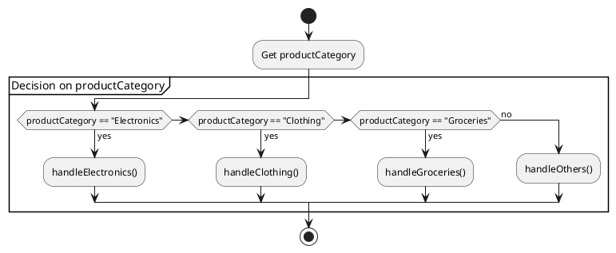

```plantuml
@startuml
start
:Get productCategory;
partition "Decision on productCategory" {
    if (productCategory == "Electronics") then (yes)
        :handleElectronics();
    else if (productCategory == "Clothing") then (yes)
        :handleClothing();
    else if (productCategory == "Groceries") then (yes)
        :handleGroceries();
    else (no)
        :handleOthers();
    endif
}
stop
@enduml
```