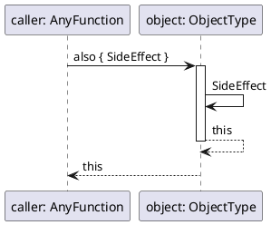

```plantuml
@startuml
participant "caller: AnyFunction" as Caller
participant "object: ObjectType" as Object

Caller -> Object : also { SideEffect }
activate Object
Object -> Object : SideEffect
Object --> Object : this
deactivate Object

Caller <-- Object : this
@enduml
```