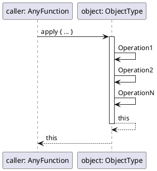

```plantuml
@startuml
participant "caller: AnyFunction" as Caller
participant "object: ObjectType" as Object

Caller -> Object : apply { ... }
activate Object

Object -> Object : Operation1
Object -> Object : Operation2
Object -> Object : OperationN
Object --> Object : this

deactivate Object
Caller <-- Object : this
@enduml

```