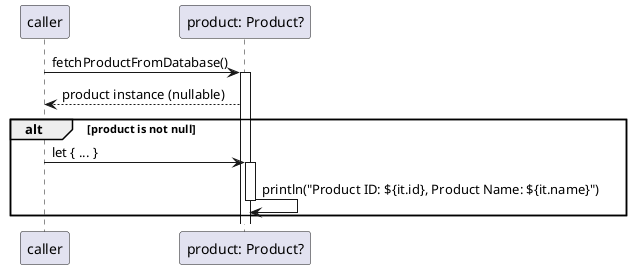
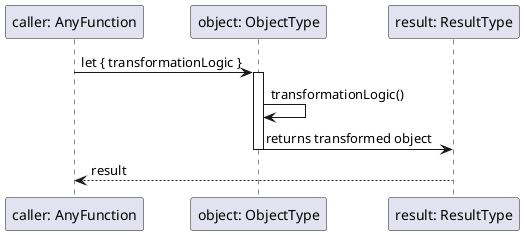

```plantuml
@startuml
participant "caller" as Caller
participant "product: Product?" as Product

Caller -> Product : fetchProductFromDatabase()
activate Product
Product --> Caller : product instance (nullable)

alt product is not null
    Caller -> Product : let { ... }
    activate Product
    Product -> Product : println("Product ID: ${it.id}, Product Name: ${it.name}")
    deactivate Product
end
@enduml

```

```plantuml
@startuml
participant "caller: AnyFunction" as Caller
participant "object: ObjectType" as Object
participant "result: ResultType" as Result

Caller -> Object : let { transformationLogic }
activate Object
Object -> Object : transformationLogic()
Object -> Result : returns transformed object
deactivate Object
Result --> Caller : result
@enduml

```