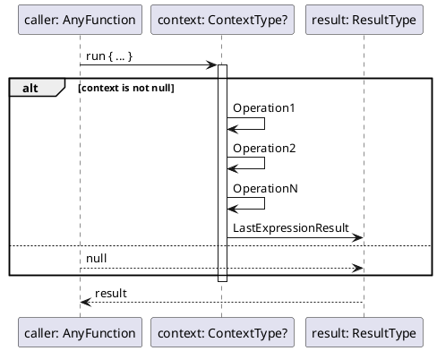

```plantuml
@startuml
participant "caller: AnyFunction" as Caller
participant "context: ContextType?" as Context
participant "result: ResultType" as Result

Caller -> Context : run { ... }
activate Context

alt context is not null
    Context -> Context : Operation1
    Context -> Context : Operation2
    Context -> Context : OperationN
    Context -> Result : LastExpressionResult
else
    Caller --> Result : null
end

deactivate Context
Result --> Caller : result
@enduml


```