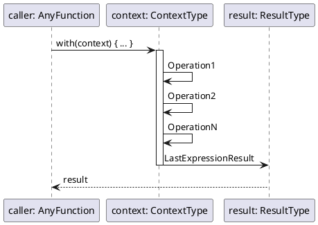
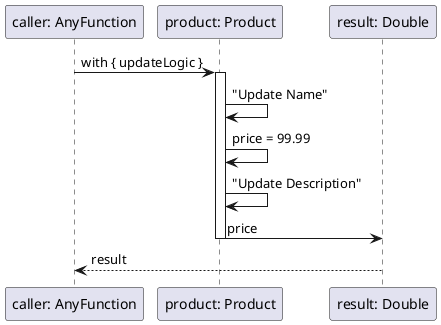

```plantuml
@startuml
participant "caller: AnyFunction" as Caller
participant "context: ContextType" as Context
participant "result: ResultType" as Result

Caller -> Context : with(context) { ... }
activate Context

Context -> Context : Operation1
Context -> Context : Operation2
Context -> Context : OperationN
Context -> Result : LastExpressionResult

deactivate Context
Result --> Caller : result
@enduml

```

```plantuml
@startuml
participant "caller: AnyFunction" as Caller
participant "product: Product" as Product
participant "result: Double" as Result

Caller -> Product : with { updateLogic }
activate Product

Product -> Product : "Update Name"
Product -> Product : price = 99.99
Product -> Product : "Update Description"
Product -> Result : price

deactivate Product
Result --> Caller : result
@enduml

```