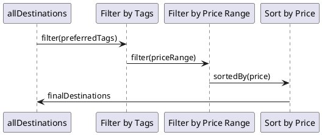

```plantuml
@startuml
participant "allDestinations" as all
participant "Filter by Tags" as tags
participant "Filter by Price Range" as price
participant "Sort by Price" as sort

all -> tags : filter(preferredTags)
tags -> price : filter(priceRange)
price -> sort : sortedBy(price)
sort -> all : finalDestinations
@enduml

```