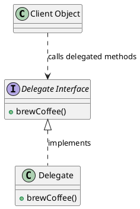

```plantuml

@startuml

class "Client Object" as client {
}

interface "Delegate Interface" as delegateInterface {
  +brewCoffee()
}

class "Delegate" as delegate {
  +brewCoffee()
}

client -[dashed]-> delegateInterface : calls delegated methods
delegateInterface <|.. delegate : implements

@enduml


```