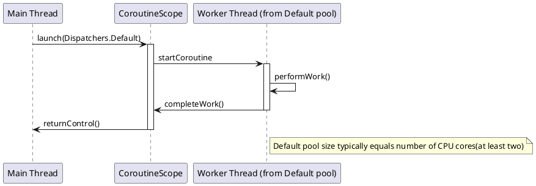

```plantuml
@startuml

participant "Main Thread" as Main
participant "CoroutineScope" as Scope
participant "Worker Thread (from Default pool)" as Worker

Main -> Scope : launch(Dispatchers.Default)
activate Scope
Scope -> Worker : startCoroutine
activate Worker
Worker -> Worker : performWork()
Worker -> Scope : completeWork()
deactivate Worker
Scope -> Main : returnControl()
deactivate Scope

note right of Worker : Default pool size typically equals number of CPU cores(at least two)
@enduml
```
