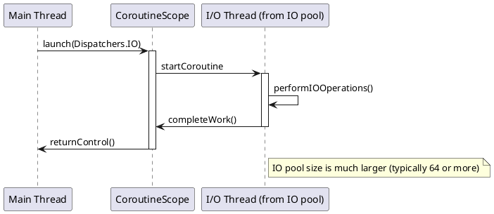

```plantuml

@startuml

participant "Main Thread" as Main
participant "CoroutineScope" as Scope
participant "I/O Thread (from IO pool)" as IO_Thread

Main -> Scope : launch(Dispatchers.IO)
activate Scope
Scope -> IO_Thread : startCoroutine
activate IO_Thread
IO_Thread -> IO_Thread : performIOOperations()
IO_Thread -> Scope : completeWork()
deactivate IO_Thread
Scope -> Main : returnControl()
deactivate Scope

note right of IO_Thread : IO pool size is much larger (typically 64 or more)

@enduml
```
