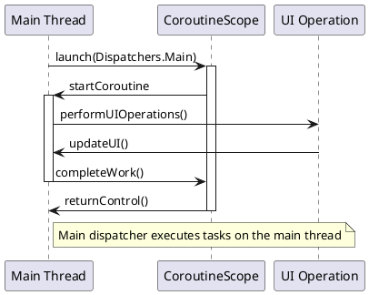

```plantuml


@startuml

participant "Main Thread" as Main
participant "CoroutineScope" as Scope
participant "UI Operation" as UI_Op

Main -> Scope : launch(Dispatchers.Main)
activate Scope
Scope -> Main : startCoroutine
activate Main
Main -> UI_Op : performUIOperations()
UI_Op -> Main : updateUI()
Main -> Scope : completeWork()
deactivate Main
Scope -> Main : returnControl()
deactivate Scope

note right of Main : Main dispatcher executes tasks on the main thread

@enduml

```
