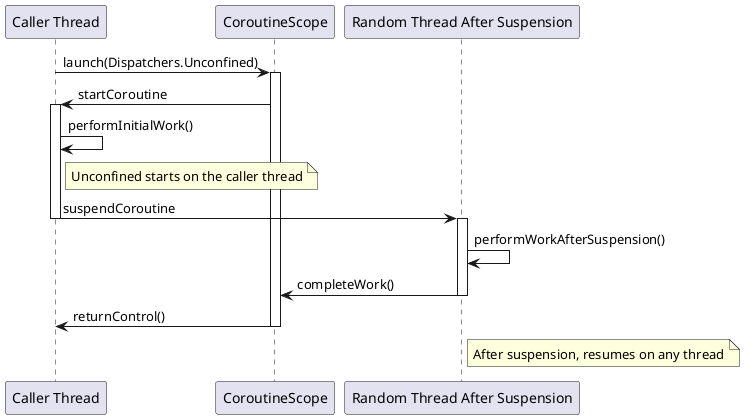

```plantuml

@startuml

participant "Caller Thread" as Caller
participant "CoroutineScope" as Scope
participant "Random Thread After Suspension" as Random

Caller -> Scope : launch(Dispatchers.Unconfined)
activate Scope
Scope -> Caller : startCoroutine
activate Caller
Caller -> Caller : performInitialWork()
note right of Caller : Unconfined starts on the caller thread
Caller -> Random : suspendCoroutine
deactivate Caller
activate Random
Random -> Random : performWorkAfterSuspension()
Random -> Scope : completeWork()
deactivate Random
Scope -> Caller : returnControl()
deactivate Scope

note right of Random : After suspension, resumes on any thread

@enduml

```
