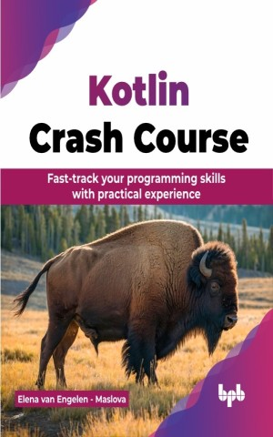

# Kotlin Crash Course

Quickly master Kotlin by practicing what you learn

This is the repository for [Kotlin Crash Course
](https://bpbonline.com/products/kotlin-crash-course?variant=43876889985224),published by BPB Publications.

## About the Book
Kotlin Crash Course is a fast-paced, hands-on introduction to Kotlin, preparing readers to build robust applications efficiently using the latest language features and best practices.

The book is divided into comprehensive chapters that cover key Kotlin programming topics such as object-oriented and functional programming, collections, concurrency, and unit testing. Each chapter takes a learning by doing approach, focusing on practical projects rather than solely theoretical knowledge. This strategy improves knowledge retention by simulating real-life experiences, allowing students to apply concepts in practice as they learn them. Furthermore, the book is interwoven with an abundance of best practices obtained from industry experience. This approach ensures that even beginners can gain seasoned insights and apply their knowledge confidently to real-world challenges.

By the end of this comprehensive course, you will not only possess a strong foundation in Kotlin programming but also the practical skills to build real-world applications, including REST APIs and serverless applications leveraging Kotlin's cloud capabilities.

## What You Will Learn
• Understand Kotlin syntax and basic coding conventions.

• Master object-oriented and functional programming concepts.

• Utilize Kotlin’s collection framework effectively.

• Implement concurrency and parallelism with coroutines.

• Build robust applications with best practices.

• Develop diverse applications, including REST APIs and serverless solutions.
